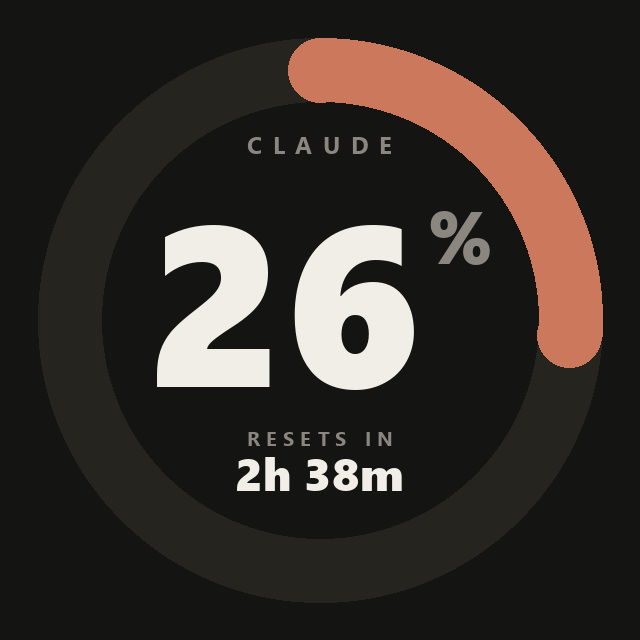
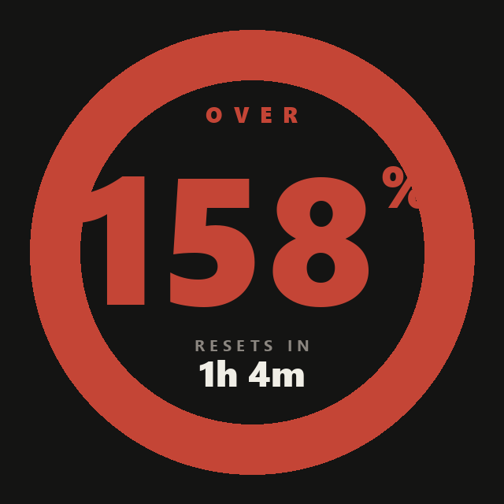
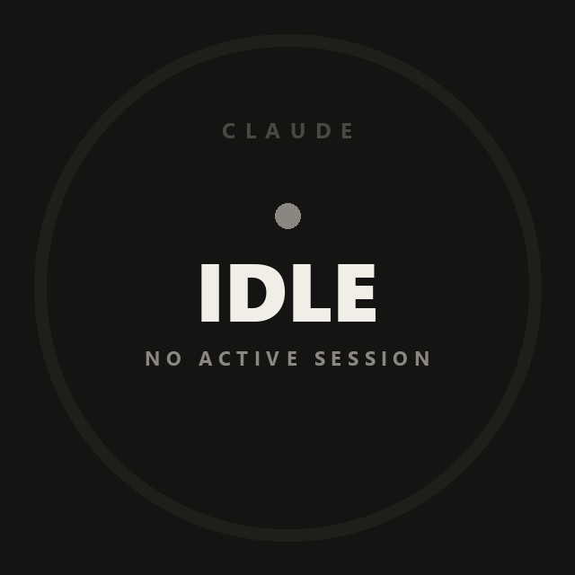
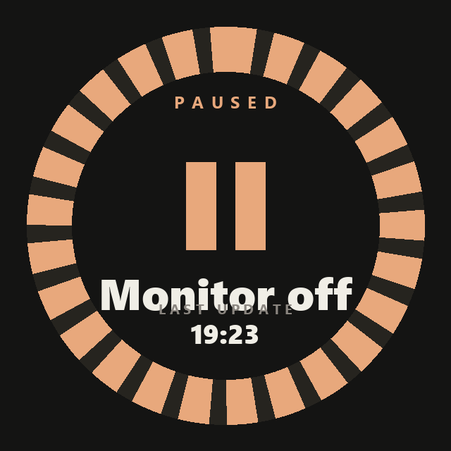
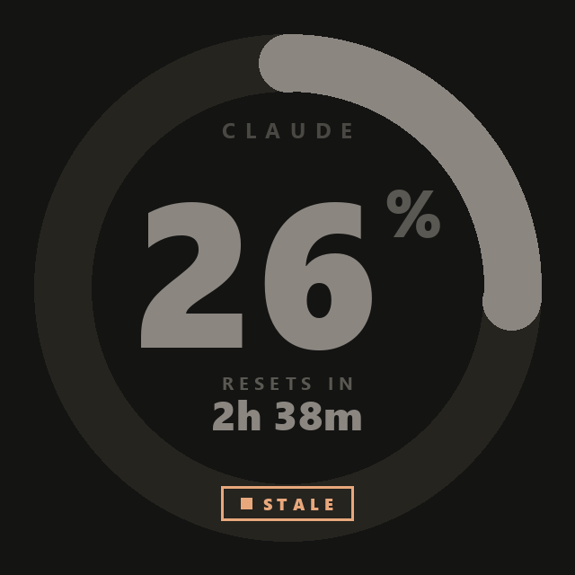

# kraken-claude-monitor

> Live Claude-Code-Quota auf dem NZXT Kraken AIO LCD anzeigen.

Pillow-rendered 240×240-Frames mit aktuellem 5h-Block-Verbrauch, Reset-Zeit und distinkten States für Idle / Paused / Stale / Over. Läuft als Windows-Autostart-Task im Hintergrund, polled `ccusage` alle 10s und pusht den Frame über `liquidctl` an die Kraken-Pumpe.



## States

| Active | Over | Idle | Paused | Stale |
|--------|------|------|--------|-------|
|  |  |  |  |  |
| Live-Verbrauch im 5h-Block | Über dem Limit (≥100%) | Keine aktive Session | Monitor gestoppt, mit letztem Update | ccusage 3×+ failed, alte Daten markiert |

## Voraussetzungen

- **Hardware:** NZXT Kraken 2023 (PID `1E71:300E`) oder kompatibel. Andere Kraken-Modelle erfordern ggf. Anpassung von `lcd_resolution` und Custom-Treiber-GUID — siehe `docs/sprint-1/WINUSBCDC-PATCH.md`.
- **OS:** Windows 11 (auf Windows 10 sollte's funktionieren, ungetestet).
- **Python:** 3.11+
- **Node.js:** 20+ (für `ccusage`)
- **Claude Code:** Pro/Max-Abo mit aktiver Session-Historie (sonst gibt's nichts anzuzeigen).

## Quick Start

```powershell
# 1. Repo klonen
git clone https://github.com/<user>/kraken-claude-monitor.git
cd kraken-claude-monitor

# 2. Virtuelles Environment + Dependencies
python -m venv .venv
.\.venv\Scripts\activate
pip install -e ".[dev]"

# 3. libusb-DLL-Fix (Python 3.14 + libusb-package 1.0.26.1 Bug)
python scripts/post_install.py

# 4. Treiber-Layout verifizieren (i.d.R. ohne Zadig nötig)
liquidctl list
# Erwartet: "Device #N: NZXT Kraken 2023"
# Falls leer: docs/sprint-1/ZADIG-SETUP.md durcharbeiten.

# 5. CAM-LCD auf "Off" stellen (sonst Frame-Konflikt)
# Siehe docs/sprint-1/CAM-COEXISTENCE.md

# 6. Smoke-Test
python -m kraken_monitor status
# [OK] Config / [OK] Kraken gefunden / Liquid temperature: ... °C

python scripts/make_test_gif.py
python -m kraken_monitor test-push frames/test.png
# Test-Bild sollte aufm LCD erscheinen.

# 7. Live-Loop starten (bleibt im Terminal bis Ctrl+C)
python -m kraken_monitor

# 8. Autostart bei Login einrichten (optional)
.\install\install.ps1
```

## Konfiguration

`config.default.toml` liegt im Repo. Eigene Overrides in `config.local.toml` (gitignored):

```toml
[monitor]
poll_interval_sec = 10
brightness_pct = 100  # 0-100, 100 für maximale Lesbarkeit unter Glas
log_level = "INFO"

[plan]
# "auto" nutzt ccusage --token-limit max (historisches Maximum als Proxy).
# "pro" / "max5" / "max20" nutzen session_token_limit als festen Wert.
type = "auto"

# Fallback wenn ccusage kein Limit liefert ODER plan.type != "auto".
# Realistic für Pro mit Opus 1M-Context: ~800-900 Mio (inkl. Cache-Reads).
session_token_limit = 850000000

[theme]
# Claude-Brand-Palette. Anpassen für eigenes Setup.
bg_color      = "#141413"
primary_color = "#CC785C"
text_color    = "#F0EEE6"
muted_color   = "#8B8680"
warning_color = "#E8A87C"
danger_color  = "#C44536"
ok_color      = "#5C9D4F"
track_color   = "#26241F"
```

## Wenn die Anzeige nicht zu deinem realen % passt

ccusage's `--token-limit max` liefert nur das **historische Maximum** deines Verbrauchs, nicht das echte Plan-Limit. Wenn du noch nie ans Limit gestoßen bist, zeigt der Monitor zu hoch.

Workaround: Berechne dein echtes Limit aus einem bekannten Verbrauchswert. Beispiel: dein Claude-Code-Statusline zeigt 26% bei 220 M Tokens → echtes Limit ≈ 220M / 0.26 ≈ 845M. Trag den Wert in `config.local.toml` ein und setz `plan.type = "pro"`.

## CLI

```
python -m kraken_monitor              # = run (default)
python -m kraken_monitor run          # Main-Loop, 10s-Poll, Ctrl+C zum Stoppen
python -m kraken_monitor status       # Config + CAM- + Kraken-Status checken
python -m kraken_monitor test-push P  # Bild aufs LCD (PNG/JPG/BMP)
python -m kraken_monitor version
```

## Autostart

```powershell
# Einmalig:
.\install\install.ps1
# Registriert "Kraken Claude Monitor" im Task Scheduler (User-Task, kein Admin nötig).

# Verwaltung:
Start-ScheduledTask  -TaskName "Kraken Claude Monitor"
Stop-ScheduledTask   -TaskName "Kraken Claude Monitor"
Get-ScheduledTaskInfo -TaskName "Kraken Claude Monitor"

# Entfernen:
.\install\uninstall.ps1
```

Logs landen in `%USERPROFILE%\kraken-claude-monitor.log` (Rotating, 1 MB × 3 Backups). Beim Shutdown des Loops (Ctrl+C, Stop-ScheduledTask) wird ein **PAUSED**-Frame mit Zeitstempel des letzten Updates aufs LCD gepusht — sichtbar dass der Monitor nicht mehr live ist.

## Architektur

```
ccusage (JSON)  →  QuotaSnapshot  →  Pillow PNG  →  liquidctl  →  Kraken-LCD
   10s-Poll                          640×640 Frame    USB (MI_00 WinUSB + MI_01 HidUsb)
```

- `src/kraken_monitor/ccusage.py` — Subprocess-Wrapper, JSON-Parser, `QuotaSnapshot`
- `src/kraken_monitor/renderer.py` — Pillow-Render, 4 State-Renderer, Cap-Geometrie
- `src/kraken_monitor/theme.py` — Layout-Konstanten + Multi-Weight-Font-Loader + `color_for_pct`
- `src/kraken_monitor/kraken.py` — `liquidctl`-Wrapper + Custom-WinUSB-GUID-Patch
- `src/kraken_monitor/loop.py` — Main-Loop, Stale-Backoff, Reconnect, Graceful-Shutdown
- `src/kraken_monitor/config.py` — TOML-Loader, Dataclass-Validation
- `install/` — PowerShell-Scripts für Task-Scheduler

Test-Coverage 35 Tests (`pytest`), CI-ready.

## Tests

```powershell
pytest -q
# 35 passed
```

Tests laufen ohne Hardware — `ccusage` wird gemockt, Renderer schreibt in tmp-Pfade.

## Lint & Format

```powershell
ruff check  src/ tests/ scripts/
ruff format src/ tests/ scripts/
```

## Troubleshooting

Siehe **`docs/TROUBLESHOOTING.md`** für die häufigsten 9 Fälle:
- `liquidctl list` zeigt Kraken nicht
- `AccessDeniedError` (CAM blockiert HID)
- `AttributeError: NoneType has no write` (winusbcdc-Patch nötig)
- Verzerrtes „lila Muster" (falsche `lcd_resolution`)
- Display zeigt dauerhaft 100% (Plan-Limit-Override fehlt)
- Task-Scheduler läuft nicht nach Login
- u.a.

## Bekannte Einschränkungen

- **Windows-only.** liquidctl + winusbcdc + die Treiber-Recovery-Anleitung sind Windows-spezifisch. Linux-Port wäre möglich aber nicht geplant.
- **Kraken 2023 (PID `0x300E`) als Erstziel.** Andere Kraken-Modelle (X3, Z3, Elite, 2024 Plus) brauchen Anpassung von `_LCD_RESOLUTION` und ggf. winusbcdc-Patch — siehe `docs/sprint-1/WINUSBCDC-PATCH.md`.
- **Plan-Auto-Detection ist eine Schätzung.** ccusage's `tokenLimitStatus.limit` ist nur historisches Maximum. Für genaue Werte: `session_token_limit` in `config.local.toml` setzen.
- **Kein OAuth-Endpoint.** Bewusst ausgelassen (siehe `docs/sprint-3/USER-STORIES.md` US-016) — fragiler Beta-Endpoint, der ccusage-Pfad reicht.

## Project Structure

```
.
├── README.md                         ← Du liest's gerade
├── LICENSE                           ← MIT
├── CLAUDE.md                         ← Projekt-Regeln, Stack, Architektur-Gotchas
├── PROGRESS.md                       ← Sprint-Status, was verifiziert
├── pyproject.toml                    ← Dependencies, Build-Config
├── config.default.toml               ← Defaults
├── docs/
│   ├── VISION.md                     ← Warum das Tool existiert
│   ├── ROADMAP.md                    ← 3-Sprint-Plan
│   ├── TROUBLESHOOTING.md            ← 9 häufige Fehler
│   ├── design/mockups.html           ← Original Design-Mockups (Browser-View)
│   ├── screenshots/                  ← Demo-Frames für README
│   ├── sprint-1/                     ← Hardware-Path, Treiber, Patches
│   ├── sprint-2/                     ← Daten-Pipeline, Renderer
│   ├── sprint-3/                     ← Autostart, Polish
│   └── progress/                     ← Debug-Session-Notes
├── src/kraken_monitor/               ← Python-Package
├── tests/                            ← Pytest-Suite
├── scripts/                          ← post_install.py, make_test_gif.py
├── install/                          ← PowerShell-Setup-Scripts
└── frames/                           ← Runtime-Output (gitignored, .gitkeep behalten)
```

## License

MIT — siehe `LICENSE`.

## Credits

- [liquidctl](https://github.com/liquidctl/liquidctl) — der Open-Source-USB-Driver der Kraken & Co spricht.
- [ccusage](https://github.com/ryoppippi/ccusage) — Claude-Code-Usage-CLI.
- Anthropic — für Claude Code und das Branding.
- NZXT — für die Kraken-Hardware (auch wenn das Treiber-Reverse-Engineering kein Zuckerschlecken war).
